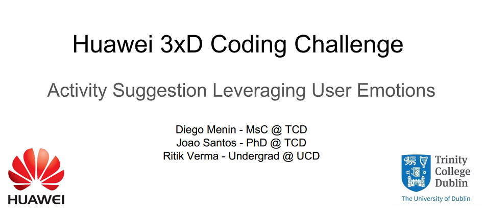

Huawei Hackaton
===================

* Diego Menin - MsC @ TCD  (https://github.com/dmenin)
* Joao Santos - PhD @ TCD  (https://github.com/facocalj)
* Ritik Verma - Undergrad @ UCD (https://github.com/ritikverma)

How to use it
-------------

#### <i class="icon-file"></i> Train the model:

* Create a "training_dataset" on the root folder.
* On that folder, create one folder for each one of the classes you want to predict
* Put the images inside (or capture with your webcam - see bellow)
* Run train_model.py

#### <i class="icon-file"></i> Capture Images with your camera (optional)
* Run capture.py
* The campera will open. Press (0, 9, 8 or 7) to capture the different emotions and dump imges into the correct folder (check code for options)
* Press "q" to quit

#### <i class="icon-file"></i> Evaluate \ test

* Run capture.py
* The campera will open. Press "l" to take a picture and run the models
* Press "q" to quit
